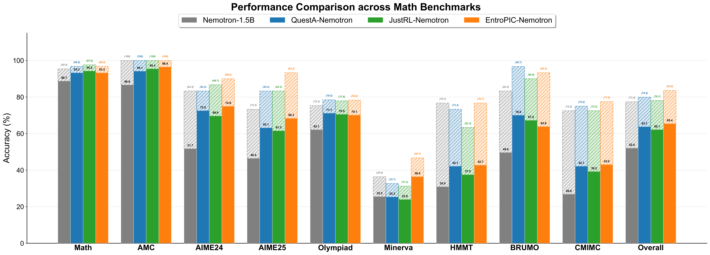
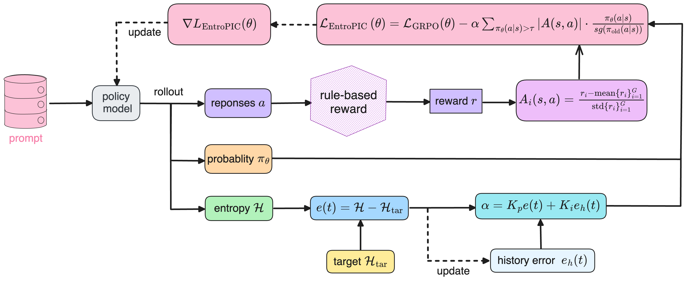
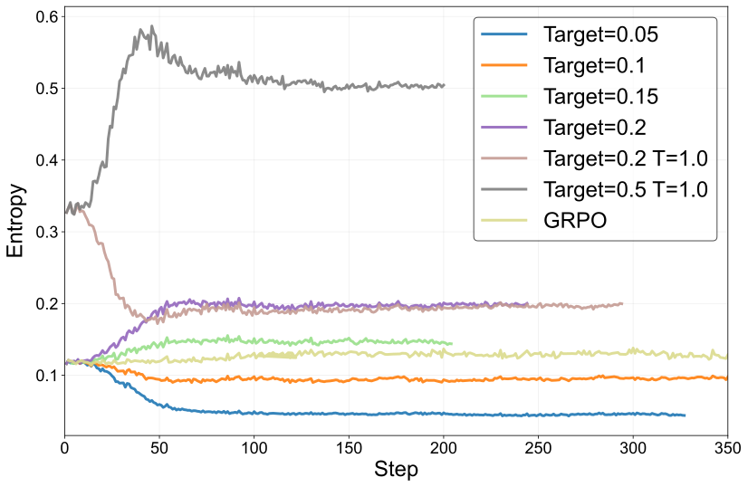
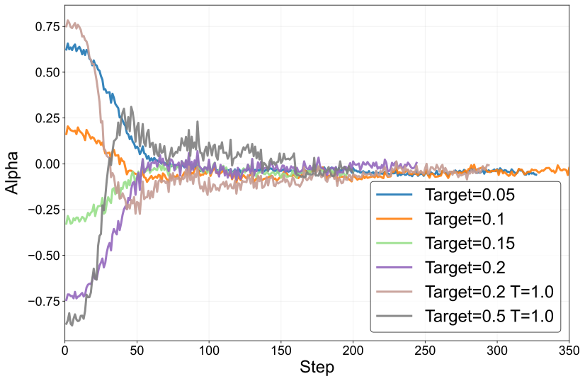
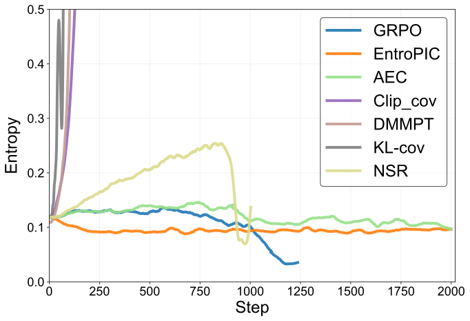
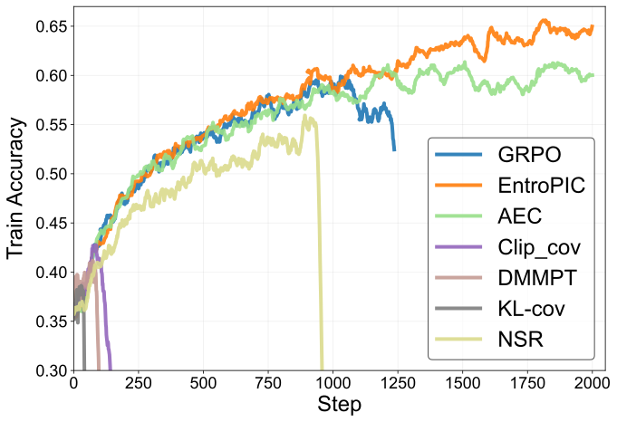
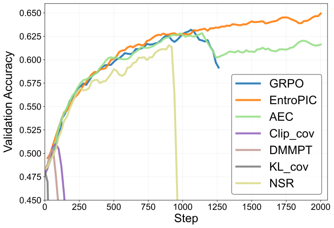

<div align="center" style="font-family: charter;">
<h1>EntroPIC: Towards Stable Long-Term Training of LLMs via Entropy Stabilization with Proportional-Integral Control</h1>

<a href="http://arxiv.org/abs/2511.15248" target="_blank">
    </a>
<a href="https://huggingface.co/spaces/yangkaiSIGS/entropic" target="_blank">
    </a>
<a href="https://huggingface.co/yangkaiSIGS/EntroPIC-Nemotron-1.5b" target="_blank">
    </a>
<a href="https://wandb.ai/1658198604/entropy?nw=nwuser1658198604" target="_blank">
    </a>

<div>
<a href="https://yk7333.github.io/" target="_blank">Kai Yang</a><sup>1</sup>,
<a href="https://xinxu-ustc.github.io/" target="_blank">Xin Xu</a><sup>1,2</sup>,
<a href="https://github.com/kkane99" target="_blank">Yangkun Chen</a><sup>1</sup>,
<a href="https://github.com/autoliuweijie" target="_blank">Weijie Liu</a><sup>1</sup>,
<a href="https://dmksjfl.github.io/" target="_blank">Jiafei Lyu</a><sup>1</sup>,
<a href="https://linzichuan.github.io/" target="_blank">Zichuan Lin</a><sup>1</sup>,
<a href="https://scholar.google.com/citations?user=jz5XKuQAAAAJ&hl=en&oi=ao" target="_blank">Deheng Ye</a><sup>1</sup>,
<a href="https://github.com/yangsaiyong" target="_blank">Saiyong Yang</a><sup>1†</sup>
</div>

<div>
<sup>1</sup>Tencent Hunyuan&emsp;<br>
<sup>2</sup>The Hong Kong University of Science and Technology
</div>
</div>

---
## 🏆 Highlight
 The 1.5b-parameter model trained with the **EntroPIC** method has surpassed current top baselines, establishing a new **SOTA** of 1.5b parameter models.
> *   **Model Access:** You can find and use the model at: [https://huggingface.co/yangkaiSIGS/EntroPIC-Nemotron-1.5b](https://huggingface.co/yangkaiSIGS/EntroPIC-Nemotron-1.5b)
> *   **Training Curves:** View the training logs and curves on Weights & Biases: [https://wandb.ai/1658198604/entropy?nw=nwuser1658198604](https://wandb.ai/1658198604/entropy?nw=nwuser1658198604)

<p align="center">
  <!-- Ensure you upload performance_chart.png to the figures folder -->
  
</p>


## 🧠 Overview
<p align="center">
  
</p>

Long-term training of LLMs requires maintaining **stable exploration** to prevent collapse into sub-optimal behaviors.  
**Entropy** plays a key role in this process by regulating exploration and preventing premature convergence.

However, RL methods often struggle to maintain an appropriate entropy level, since **positive and negative samples** affect entropy in opposite ways during training.

We introduce **EntroPIC** (**Entro**py stabilization via **P**roportional-**I**ntegral **C**ontrol) — a simple yet effective approach that **dynamically balances** the influence of positive and negative samples through adaptive loss weighting.  

⭐ **EntroPIC** provides a principled and lightweight entropy control mechanism, enabling **more efficient exploration**, **smoother optimization**, and **long-term stability** in LLM reinforcement learning.

<p align="center">
  
  
</p>

---

## 🚀 Quick Start

Follow the steps below to start **single-machine training** with **Qwen3-8B-Base** using the EntroPIC setup.

1. **Edit `run_entropic.sh`:**
   - Replace `$TRAIN_DATASET_PATH` with your training dataset path.  
   - Replace `$VALIDATION_DATASET_PATH` with your validation dataset path.  
   - Replace `$YOUR_WANDB_API_KEY` with your personal Weights & Biases API key.

2. **Start training:**
   ```bash
   bash run_entropic.sh
   ```

---

## 📊 Evaluation

We perform comprehensive evaluations on both **Reasoning Models** (Chain-of-Thought based) and **Standard Models** (Answer-only).

### 🏆 Reasoning Model Results (Nemotron-1.5B)

We applied EntroPIC to **OpenReasoning-Nemotron-1.5B**. The model demonstrates state-of-the-art performance among 1.5B parameter models, outperforming strong baselines like QuestA and JustRL on challenging mathematical benchmarks while maintaining robust generalization.

**Comparison on Mathematical Benchmarks (Avg@N)**

| Models | Math | AMC | AIME24 | AIME25 | Olympiad | Minerva | HMMT | BRUMO | CMIMC | Overall |
| :--- | :---: | :---: | :---: | :---: | :---: | :---: | :---: | :---: | :---: | :---: |
| Nemotron-1.5B | 88.7 | 86.6 | 51.7 | 46.4 | 62.1 | 25.5 | 30.9 | 49.6 | 26.8 | 52.0 |
| QuestA | 93.2 | 94.1 | 72.5 | 63.1 | **71.1** | 25.3 | 42.1 | **70.0** | 42.1 | 63.7 |
| JustRL | **94.2** | 95.4 | 69.6 | 61.5 | 70.5 | 23.9 | 37.5 | 67.2 | 39.2 | 62.1 |
| **EntroPIC** | 93.2 | **96.4** | **74.9** | **68.3** | 70.1 | **36.4** | **42.7** | 63.8 | **43.0** | **65.4** |

**Robust Generalization**  
Unlike other RL methods that suffer from "alignment tax" (forgetting general capabilities), EntroPIC improves performance on non-mathematical tasks.

| Models | MMLU-Pro (General) | LiveCodeBench (Coding) | GPQA (Science) |
| :--- | :---: | :---: | :---: |
| Nemotron-1.5B | 41.7 | 28.3 | 35.9 |
| QuestA | 30.0 | 0.0 | 13.1 |
| JustRL | 28.1 | 0.4 | 30.1 |
| **EntroPIC** | **48.2** | **40.9** | **38.9** |

<br>

### 🧩 Standard Model Results (Qwen3-8B)

For non-reasoning models, we report results based on **Qwen3-8B-Base**.  
Evaluation uses [DeepScaler](https://github.com/agentica-project/rllm) and [IFEval](https://github.com/google-research/google-research/tree/master/instruction_following_eval) protocols.

**On-policy Training Results**

| Models        | Math (avg@N / pass@N) |       AMC       |      AIME24     |      AIME25     |  Olympic Bench  |    Omni-math    |     Overall     |
| :------------ | :-------------------: | :-------------: | :-------------: | :-------------: | :-------------: | :-------------: | :-------------: |
| Initial Model |      86.1 / 97.0      |   58.4 / 81.6   |   23.4 / 60.0   |   23.0 / 53.0   |   49.9 / 68.7   |   32.0 / 49.3   |   45.5 / 68.3   |
| GRPO          |      91.2 / 97.4      |   75.1 / 88.0   |   34.3 / 70.0   |   31.0 / 53.3   |   59.1 / 72.7   |   40.7 / 57.6   |   55.2 / 73.2   |
| NSR           |      91.5 / 96.4      |   74.1 / 89.2   |   34.7 / 63.3   |   30.0 / 46.7   |   58.5 / 71.3   |   39.7 / 56.2   |   54.8 / 70.5   |
| AEC           |    **92.5 / 97.8**    |   77.6 / 89.2   |   37.1 / 73.3   |   31.6 / 60.0   | **60.9 / 72.5** |   42.0 / 58.5   |   56.9 / 75.2   |
| **EntroPIC**  |      92.4 / 97.2      | **80.1 / 91.6** | **42.3 / 76.7** | **34.6 / 66.7** |   60.0 / 71.3   | **42.7 / 58.4** | **58.7 / 77.0** |

**Off-policy Training Results**

| Models            | Math (avg@N / pass@N) |       AMC       |      AIME24     |      AIME25     |  Olympic Bench  |    Omni-math    |     Overall     |
| :---------------- | :-------------------: | :-------------: | :-------------: | :-------------: | :-------------: | :-------------: | :-------------: |
| GRPO              |      88.7 / 93.6      |   64.0 / 87.9   |   28.9 / 63.3   |   25.5 / 50.0   |   53.2 / 69.0   |   35.3 / 52.4   |   49.3 / 69.4   |
| EntroPIC (P)      |      89.8 / 96.4      | 67.8 / **90.4** | **34.8 / 66.7** | 27.5 / **53.3** |   56.4 / 71.1   |   36.6 / 54.9   |   52.2 / 72.2   |
| **EntroPIC (PI)** |    **91.9 / 97.0**    | **75.3 / 90.4** | 34.7 / **70.0** | **27.6 / 53.3** | **58.8 / 71.9** | **40.0 / 56.8** | **54.7 / 73.2** |

<p align="center">
  
  
  
</p>

---

## ⚙️ Key Code Modifications

### `dp_actor.py`: Computing Entropy Control Parameter `α` via PI Control

```python
# Compute entropy loss
entropy_loss = agg_loss(loss_mat=entropy, loss_mask=response_mask, loss_agg_mode=loss_agg_mode)
entropy_loss_item = entropy_loss.detach().item()

if self.config.target_entropy >= 0:
    control_alpha_i = self.accumulate_entropy_error * K_i
    control_alpha_p = (entropy_loss_item - self.config.target_entropy) * K_p
    control_alpha = control_alpha_i + control_alpha_p
    control_alpha = np.clip(control_alpha, -1.0, 1.0)
    self.accumulate_entropy_error += (
        entropy_loss_item - self.config.target_entropy
    ) * response_mask.shape[0] / self.config.ppo_mini_batch_size
else:
    control_alpha = 0.0

pg_loss, pg_clipfrac, ppo_kl, pg_clipfrac_lower = policy_loss_fn(
    old_log_prob=old_log_prob,
    log_prob=log_prob,
    advantages=advantages,
    response_mask=response_mask,
    loss_agg_mode=loss_agg_mode,
    config=self.config,
    rollout_is_weights=rollout_is_weights,
    control_alpha=control_alpha,
)
```

### `core_algos`: Adjusting Update Weights with the Control Coefficient

```python
def compute_policy_loss_entropic(..., control_alpha):
    pg_loss = ...
    # EntroPIC adjustment
    prob_high = (log_prob > torch.log(torch.tensor(high_prob_thresh, device=log_prob.device)))
    prob_mask = response_mask * prob_high
    pg_loss_adjust = control_alpha * agg_loss(
        -ratio * advantages.abs(),
        loss_mask=prob_mask,
        loss_agg_mode=loss_agg_mode
    )
    pg_loss = pg_loss + pg_loss_adjust
```

---

## 📮Contact
If you have any questions or would like to discuss collaboration, please feel free to contact:  
Kai Yang — [kasperyang@tencent.com](mailto:kasperyang@tencent.com)  
Saiyong Yang — [stevesyang@tencent.com](mailto:stevesyang@tencent.com)

## 📚 Citation
If you find our work helpful for your research, please consider citing our paper:
```
@article{yang2025entropic,
  title={EntroPIC: Towards Stable Long-Term Training of LLMs via Entropy Stabilization with Proportional-Integral Control},
  author={Yang, Kai and Xu, Xin and Chen, Yangkun and Liu, Weijie and Lyu, Jiafei and Lin, Zichuan and Ye, Deheng and Yang, Saiyong},
  journal={arXiv preprint arXiv:2511.15248},
  year={2025}
}
```
```
